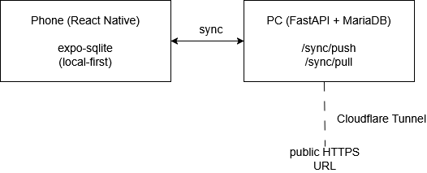

# BudgetBuddy

A personal finance tracking app built with React Native (Expo) and FastAPI. Designed for daily use across multiple devices — data lives locally on each device and syncs to a self-hosted server when available.

---

## Features

- **Accounts** — track cash, bank, card, and savings accounts with real-time balance calculation. Exclude specific accounts (e.g. savings) from your total balance.
- **Transactions** — log income, expenses, and transfers. Group by day, week, or month.
- **Recurring templates** — set up monthly bills and income (e.g. salary, subscriptions) and log them in one tap when they're due.
- **Budgets** — set an overall monthly budget and break it down by category. Track spending vs budget with progress bars and allocation warnings.
- **Reports** — monthly summaries with income/expense/net cards, spending breakdown by category (donut chart), account balance bars, and activity per account. Covers current month, last 3 months, or any specific month.
- **Themes** — Midnight (dark) and Sand (light) themes, persisted across sessions.
- **Local-first** — all data is stored in SQLite on-device. The app works fully offline; sync is optional.
- **Sync** — push/pull sync to a self-hosted FastAPI + MariaDB server via Cloudflare Tunnel, with a sync bar on the home screen showing last synced time and status.

---

## Tech Stack

### App
| Layer | Technology |
|---|---|
| Framework | React Native (Expo SDK 56) |
| Language | TypeScript |
| Local database | SQLite via `expo-sqlite` |
| Schema management | Custom migration runner |
| UI components | React Native Paper |
| Charts | `react-native-svg` (custom SVG components) |
| Navigation | React Navigation (Stack) |
| Theming | React Context + AsyncStorage |

### Sync Server
| Layer | Technology |
|---|---|
| Framework | FastAPI (Python) |
| Database | MariaDB 12 |
| ORM | SQLAlchemy |
| Auth | Bearer token |
| Tunnel | Cloudflare Tunnel |

---

## Architecture


<p align="center">
  
</p>

**Local-first design:** every write goes to SQLite immediately with `dirty = 1`. When sync runs, dirty rows are pushed to the server and the device pulls any rows updated since its last sync. Conflict resolution is last-write-wins on `updated_at`.

**Migration system:** schema changes are versioned migration files (`src/db/migrations/`). On startup, the app checks which migrations haven't run yet and applies them in order — no manual schema recreation needed.

---

## Quick Setup (Windows)

Double-click `setup.bat` at the project root. It will:
- Check for Node.js and Python
- Install app dependencies (`npm install`, `expo install react-native-svg`)
- Create a Python virtual environment for the sync server
- Install Python dependencies
- Copy `.env.example` → `.env` in both `app/` and `sync_server/`

After running it, fill in the two `.env` files and follow the printed next steps.

---

## Manual Setup

### App

```bash
cd app
npm install
npx expo install react-native-svg
cp .env.example .env       # fill in sync server details if using sync
npx expo start
```

Open in browser at `http://localhost:8081` or scan the QR code with Expo Go on your phone.

> **Note:** SQLite persistence on web uses the OPFS (Origin Private File System) API. The app works fully on native (Android/iOS) via Expo Go or a production build.

### Sync Server

```bash
cd sync_server
python -m venv venv
venv\Scripts\activate        # Windows
# source venv/bin/activate   # macOS/Linux
pip install -r requirements.txt
cp .env.example .env         # fill in DB credentials and auth token
mysql -u your_user -p your_db < schema.sql
uvicorn app.main:app --reload --host 0.0.0.0 --port 8000
```

**Required `.env` values:**
```
DB_HOST=localhost
DB_PORT=3306
DB_NAME=budget_buddy
DB_USER=your_user
DB_PASSWORD=your_password
SYNC_AUTH_TOKEN=your_secret_token
```

### Cloudflare Tunnel (optional, for phone sync)

```bash
# Download cloudflared from https://github.com/cloudflare/cloudflared/releases
cloudflared tunnel --url http://localhost:8000
# Copy the generated URL into app/.env as EXPO_PUBLIC_SYNC_URL
```

---

## Sync Protocol

The app uses a simple push/pull protocol over HTTPS:

| Endpoint | Method | Description |
|---|---|---|
| `/sync/ping` | GET | Health check — confirms auth and DB connectivity |
| `/sync/push` | POST | Send dirty rows from device to server |
| `/sync/pull` | POST | Fetch rows updated since device's last sync |

Each device has a unique `device_id` stored in `local_meta`. The server tracks `last_synced_at` per device in `device_sync_state`. Conflict resolution is last-write-wins on `updated_at`.

The sync bar on the home screen is only visible when `EXPO_PUBLIC_SYNC_URL` and `EXPO_PUBLIC_SYNC_TOKEN` are set in `app/.env` — the app works fully without a sync server configured.

---

## Project Structure

```
BudgetBuddy/
├── setup.bat                     # One-click setup script (Windows)
├── .gitignore
├── README.md
├── app/                          # React Native app (Expo)
│   ├── src/
│   │   ├── db/
│   │   │   ├── index.ts          # DB init + migration runner
│   │   │   ├── migrations/       # Versioned schema migrations
│   │   │   ├── accounts.ts
│   │   │   ├── transactions.ts
│   │   │   ├── budgets.ts
│   │   │   ├── recurring.ts
│   │   │   └── reports.ts
│   │   ├── screens/
│   │   │   ├── HomeScreen.tsx
│   │   │   ├── AccountsScreen.tsx
│   │   │   ├── AccountDetailScreen.tsx
│   │   │   ├── TransactionsScreen.tsx
│   │   │   ├── RecurringScreen.tsx
│   │   │   ├── BudgetsScreen.tsx
│   │   │   ├── BudgetAllocationScreen.tsx
│   │   │   └── ReportsScreen.tsx
│   │   ├── sync/
│   │   │   └── index.ts          # Push/pull sync client
│   │   ├── context/
│   │   │   └── ThemeContext.tsx
│   │   └── theme/
│   │       └── index.ts
│   ├── .env.example
│   └── App.tsx
└── sync_server/                  # FastAPI sync server
    ├── app/
    │   ├── main.py
    │   ├── db.py
    │   ├── models.py
    │   ├── auth.py
    │   └── routes/
    │       └── sync.py
    ├── schema.sql
    ├── requirements.txt
    └── .env.example
```

---

## Attribution

Icons sourced from [Flaticon](https://www.flaticon.com/):

**UI icons**
- Accounts — [mikan933](https://www.flaticon.com/free-icons/bank-account)
- Bank — [Freepik](https://www.flaticon.com/free-icons/law)
- Budgets — [Freepik](https://www.flaticon.com/free-icons/budget)
- Card — [Freepik](https://www.flaticon.com/free-icons/credit-card)
- Cash — [Freepik](https://www.flaticon.com/free-icons/euro)
- Chart — [firzuals](https://www.flaticon.com/free-icons/business-and-finance)
- Home — [Freepik](https://www.flaticon.com/free-icons/housing)
- Moon — [POD Gladiator](https://www.flaticon.com/free-icons/moon-phase)
- Other (folder) — [Smashicons](https://www.flaticon.com/free-icons/folder)
- Recurring — [Us and Up](https://www.flaticon.com/free-icons/recurring-payment)
- Recurring payment — [surang](https://www.flaticon.com/free-icons/recurring-payment)
- Reports — [HAJICON](https://www.flaticon.com/free-icons/results)
- Savings — [bsd](https://www.flaticon.com/free-icons/save-money)
- Sun — [Freepik](https://www.flaticon.com/free-icons/sun)
- Target/Aim — [LAFS](https://www.flaticon.com/free-icons/effectiveness)
- Template — [Ylivdesign](https://www.flaticon.com/free-icons/finance)
- Transactions — [LAFS](https://www.flaticon.com/free-icons/transaction)

**Expense category icons**
- Education — [Freepik](https://www.flaticon.com/free-icons/education)
- Entertainment — [Freepik](https://www.flaticon.com/free-icons/cinema)
- Food & Drink — [juicy_fish](https://www.flaticon.com/free-icons/beverage)
- Groceries — [Freepik](https://www.flaticon.com/free-icons/groceries)
- Health — [Freepik](https://www.flaticon.com/free-icons/health)
- Housing — [Freepik](https://www.flaticon.com/free-icons/house)
- Other — [yaicon](https://www.flaticon.com/free-icons/more)
- Shopping — [Good Ware](https://www.flaticon.com/free-icons/paper-bag)
- Subscriptions — [Danteee82](https://www.flaticon.com/free-icons/subscription)
- Transport — [geotatah](https://www.flaticon.com/free-icons/transport)
- Utilities — [Freepik](https://www.flaticon.com/free-icons/repair)

**Income category icons**
- Freelance — [Freepik](https://www.flaticon.com/free-icons/send)
- Gift — [Freepik](https://www.flaticon.com/free-icons/gift)
- Other Income — [afif fudin](https://www.flaticon.com/free-icons/wealth)
- Salary — [Ardiansyah](https://www.flaticon.com/free-icons/wage)

---

## License

This project is licensed under the MIT License.